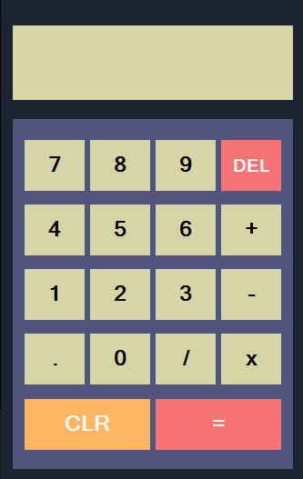

# ModernUI-Calculator👌

## 👋Welcome!👋

 
### This is a simple program I created using C++. 

A Calculator with a modern design inspired by 
one of the challenges from frontendmentor.io

This app can basically do anything a simple calculator would do

It can:

* Add
* Subtract
* Divide
* Multiply 

It is like I said, a basic calculator.

Thanks for taking the time to read this.

.exe files are available within the x64 folder.

Feel free to message me at drakekhendrick@gmail.com for questions and suggestions <3

### Thanks!
